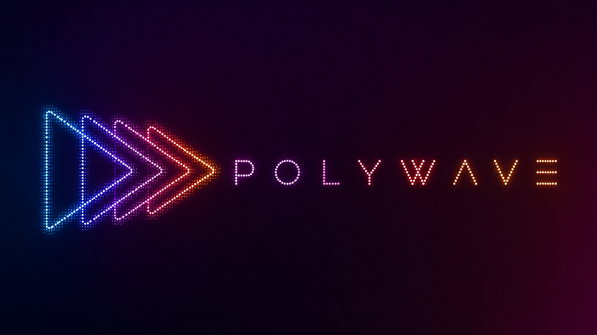

<p align="center">
  
</p>

<h1 align="center">polywave-go</h1>

<p align="center">
  <a href="https://github.com/blackwell-systems"></a>
  <a href="https://github.com/blackwell-systems/polywave-go/actions/workflows/ci.yml"></a>
  <a href="https://github.com/blackwell-systems/polywave-go/releases"></a>
  <a href="https://buymeacoffee.com/blackwellsystems"></a>
</p>

<p align="center">Go engine, Protocol SDK, and <code>polywave-tools</code> CLI for Polywave: a coordination protocol for parallel AI agent development that makes merge conflicts structurally impossible when work can be decomposed safely.</p>

> **Using Claude Code?** Start at [polywave](https://github.com/blackwell-systems/polywave) for the Agent Skill and install guide. This repo provides the engine and CLI that the skill depends on.

Polywave is not a generic agent runner. It is a protocol for deciding when parallel agent work is suitable, partitioning that work by file ownership, enforcing the partition before agents start, and merging completed work through deterministic gates.

---

## The Core Guarantee

**No two agents in the same wave own the same file** (I1: Disjoint File Ownership).

This is a hard constraint, not a convention. Polywave validates the ownership partition before creating worktrees. Branches and worktrees isolate concurrent edits, but they do not prevent two agents from independently modifying the same file and producing a merge conflict later. Polywave prevents that conflict from being possible on agent-owned files.

The result: when the suitability gate passes and invariants hold, parallel agents can work independently, commit independently, and merge mechanically.

---

## When To Use Polywave

Use Polywave for agentic development when the work has real parallel structure:

- Multi-file feature work with separable modules or components
- Refactors that can be split by package, route, service, adapter, or UI area
- Audit-remediation work after findings have been classified
- Multi-feature programs where tier ordering and shared contracts matter
- Tasks where build/test verification is expensive enough that parallelism pays for the orchestration overhead

Do not use Polywave for every edit. The protocol runs a mandatory suitability gate that answers five questions before producing any agent prompts. If work does not decompose cleanly, the Scout returns `NOT_SUITABLE` and stops. This is a structural boundary, not a suggestion.

Polywave is usually the wrong tool for:

- Tiny one-file changes
- Investigation-first debugging where the root cause is unknown
- Work where cross-agent interfaces cannot be defined before implementation
- Highly coupled edits to the same central file
- Exploratory prototypes where discovery is more valuable than execution discipline

This is intentional. The protocol includes its own "do not use Polywave here" decision point.

---

## Install

```bash
# Homebrew (macOS/Linux)
brew install blackwell-systems/tap/polywave-tools

# Or via Go install
go install github.com/blackwell-systems/polywave-go/cmd/polywave-tools@latest
```

<details>
<summary>Download a pre-built binary</summary>

Pre-built binaries for macOS and Linux are attached to every [GitHub release](https://github.com/blackwell-systems/polywave-go/releases/latest).

```bash
# macOS Apple Silicon example
VERSION=$(curl -sI https://github.com/blackwell-systems/polywave-go/releases/latest | grep -i location | sed 's|.*/v||;s/\r//')
curl -sL "https://github.com/blackwell-systems/polywave-go/releases/download/v${VERSION}/polywave-tools_${VERSION}_darwin_arm64.tar.gz" | tar xz
mkdir -p ~/.local/bin && mv polywave-tools ~/.local/bin/
```

Available archives:

- `polywave-tools_{version}_darwin_arm64.tar.gz`
- `polywave-tools_{version}_darwin_amd64.tar.gz`
- `polywave-tools_{version}_linux_amd64.tar.gz`
- `polywave-tools_{version}_linux_arm64.tar.gz`
</details>

<details>
<summary>Build from source</summary>

```bash
go build -o polywave-tools ./cmd/polywave-tools
cp polywave-tools ~/.local/bin/polywave-tools
```
</details>

---

## Quickstart

Initialize a repository:

```bash
cd your-project
polywave-tools init
```

Produce or validate an IMPL manifest:

```bash
polywave-tools run-scout "Add rate limiting to the API" --repo-dir "$PWD"
polywave-tools validate docs/IMPL/IMPL-rate-limiting.yaml
```

Prepare and finalize the first wave:

```bash
polywave-tools prepare-wave docs/IMPL/IMPL-rate-limiting.yaml --wave 1 --repo-dir "$PWD"

# Agents run in their assigned worktrees, commit, and write completion reports.

polywave-tools finalize-wave docs/IMPL/IMPL-rate-limiting.yaml --wave 1 --repo-dir "$PWD"
```

Claude Code users normally invoke the higher-level `/polywave` AgentSkills workflow. This repository provides the Go engine and CLI that make the protocol executable.

---

## How It Works

Polywave execution has three core phases.

**Scout:** An agent analyzes the repository, runs the suitability gate, designs the file ownership partition, defines cross-agent interface contracts, and writes an IMPL manifest.

**Wave:** Parallel agents execute concurrently. Each agent owns a disjoint set of files, works in its own git worktree, implements against pre-committed scaffold files, commits its changes, and writes a completion report back to the IMPL manifest.

**Merge + Verify:** `finalize-wave` verifies commits, checks completion reports, predicts conflicts, scans for stubs, runs quality gates, merges agent branches, verifies the merged build, records integration gaps, and cleans up worktrees.

Wave N+1 does not launch until Wave N has merged and passed post-merge verification. Later waves coordinate through committed code, not direct agent-to-agent communication.

---

## The IMPL Manifest

The IMPL manifest is the single source of truth for a feature. Chat output is not protocol state.

It records:

- Suitability verdict and reasoning
- File ownership by agent, wave, and repository
- Interface contracts and scaffold status
- Quality gates
- Wave structure and agent prompts
- Completion reports
- Stub, wiring, and integration reports
- Protocol state

Abbreviated example:

```yaml
title: "API rate limiting"
feature_slug: "rate-limiting"
repository: "/path/to/repo"
state: "REVIEWED"
verdict: "SUITABLE"
test_command: "go test ./..."
lint_command: "go vet ./..."

file_ownership:
  - file: "pkg/ratelimit/limiter.go"
    agent: "A"
    wave: 1
    action: "new"
  - file: "internal/api/middleware.go"
    agent: "B"
    wave: 1
    action: "modify"

interface_contracts:
  - name: "Limiter"
    location: "pkg/ratelimit/limiter.go"
    definition: "type Limiter interface { Allow(key string) bool }"

waves:
  - number: 1
    agents:
      - id: "A"
        task: "Implement the limiter package."
        files: ["pkg/ratelimit/limiter.go"]
      - id: "B"
        task: "Wire the limiter into API middleware."
        files: ["internal/api/middleware.go"]
        dependencies: []
```

All structural operations on this manifest are deterministic Go code. LLMs analyze and implement; the SDK validates, gates, and records.

---

## What This Repo Provides

- **Protocol SDK:** Importable Go package for manifests, invariants, validation, state transitions, conflict prediction, gates, and program-level manifests.
- **Engine:** High-level lifecycle entrypoints for Scout, Planner, wave preparation, wave finalization, tier execution, autonomy, retry, and integration validation.
- **CLI:** `polywave-tools`, a command-line interface over the protocol and engine.
- **Agent backends:** Provider routing for Anthropic, OpenAI-compatible APIs, AWS Bedrock, Ollama, LM Studio, and local CLI execution.
- **Program layer:** Tier-gated execution of multiple IMPLs with shared contract freezing.

Provider routing uses model prefixes:

| Prefix | Backend |
|--------|---------|
| `anthropic:` | Anthropic API |
| `openai:` | OpenAI-compatible endpoint |
| `bedrock:` | AWS Bedrock |
| `ollama:` | Ollama OpenAI-compatible endpoint |
| `lmstudio:` | LM Studio OpenAI-compatible endpoint |
| `cli:` | Local CLI binary |
| *(none)* | Auto-detect from environment |

Each agent may specify its own `model:` in the IMPL manifest, so one wave can mix providers and model sizes without changing orchestration code.

---

## Essential CLI Commands

| Command | Purpose |
|---------|---------|
| `init` | Detect project language and default build/test commands |
| `run-scout` | Launch Scout and produce an IMPL manifest |
| `validate` | Validate IMPL manifest structure and invariants |
| `prepare-wave` | Run baseline gates, create worktrees, extract briefs, initialize journals |
| `finalize-wave` | Verify, gate, merge, build, and clean up a wave |
| `check-conflicts` | Enforce I1 file ownership disjointness |
| `validate-scaffolds` | Verify scaffold files are committed before launch |
| `freeze-check` | Enforce interface contract freeze |
| `validate-integration` | Detect wiring and integration gaps |
| `set-completion` | Record an agent completion report |
| `set-impl-state` | Apply a protocol state transition |
| `resume-detect` | Detect interrupted sessions |
| `daemon` | Run queued IMPLs under autonomy settings |

The CLI contains many more single-purpose commands for advanced validation, program execution, review, retry, observability, and recovery. See [`cmd/polywave-tools/README.md`](cmd/polywave-tools/README.md) for command-level reference.

---

## Protocol SDK

The `pkg/protocol` package is the deterministic core. It has no LLM dependency.

```go
import "github.com/blackwell-systems/polywave-go/pkg/protocol"

manifest, err := protocol.Load(ctx, "docs/IMPL/IMPL-feature.yaml")
if err != nil {
    return err
}

errs := protocol.Validate(manifest)
i1Errs := protocol.ValidateI1DisjointOwnership(manifest, 1)
wave := protocol.CurrentWave(manifest)

_ = i1Errs
_ = wave

protocol.SetCompletionReport(manifest, "A", protocol.CompletionReport{
    Status:       protocol.StatusComplete,
    Commit:       "abc123",
    Branch:       "polywave/my-feature/wave1-agent-A",
    FilesCreated: []string{"pkg/cache/cache.go"},
})

save := protocol.Save(ctx, manifest, "docs/IMPL/IMPL-feature.yaml")
if save.IsFatal() {
    return fmt.Errorf("save failed: %v", save.Errors)
}
```

Invariant enforcement:

| Invariant | Enforcement |
|-----------|-------------|
| I1: Disjoint file ownership | `Validate`, `check-conflicts`, prepare-wave fast-fail, merge prediction |
| I2: Interface contracts precede implementation | Scaffold validation and freeze checks before worktree launch |
| I3: Wave sequencing | Prepare-wave blocks later waves until prior waves complete |
| I4: IMPL manifest is source of truth | Completion reports and state transitions are manifest writes |
| I5: Agents commit before reporting | Completion report validation and `verify-commits` gate |
| I6: Role separation | Agent role boundaries, Scout write-boundary checks, and orchestration discipline |

---

## Program Layer

For larger work, a PROGRAM manifest coordinates multiple IMPL manifests through tiers.

- Same-tier IMPLs must be independent.
- Later tiers may depend on earlier tiers.
- Program contracts are materialized and frozen before downstream Scouts consume them.
- Tier gates block advancement on failure.
- IMPL branches isolate in-progress tier work until the tier is finalized.

This extends the same idea as waves: tiers are to IMPLs what waves are to agents.

---

## Architecture

Five repositories separate the protocol, skills, engine, and UI:

| Repository | Purpose |
|-----------|---------|
| [polywave-protocol](https://github.com/blackwell-systems/polywave-protocol) | Normative protocol specification: invariants, execution rules, state machine, message formats |
| [polywave](https://github.com/blackwell-systems/polywave) | Claude Code implementation: Agent Skill, hooks, agent prompts |
| [polywave-codex](https://github.com/blackwell-systems/polywave-codex) | Codex CLI implementation: same protocol, different platform |
| **polywave-go** | Go engine, Protocol SDK, and `polywave-tools` CLI |
| [polywave-web](https://github.com/blackwell-systems/polywave-web) | Web UI and HTTP/SSE server using this engine |

The protocol repo defines the semantics. This repo implements them. The skill repos (polywave, polywave-codex) shape agent behavior on their respective platforms. The web repo provides an operator interface.

Package map:

```text
pkg/
├── protocol/       # Manifest types, validation, invariants, gates, merge logic
├── engine/         # RunScout, PrepareWave, FinalizeWave, program/tier execution
├── orchestrator/   # Wave orchestration, backend routing, event flow
├── agent/          # Agent runtime and backend interface
├── analyzer/       # Dependency, cascade, wiring, and shared-type analysis
├── hooks/          # Boundary and prelaunch checks
├── journal/        # Append-only execution trace and context recovery
├── observability/  # Event model, metrics, SQLite store
├── retry/          # Failure classification and retry support
├── worktree/       # Git worktree management
└── result/         # Canonical Result[T] error model

internal/
└── git/            # Git command wrappers
```

See [`pkg/README.md`](pkg/README.md) for a deeper package map.

---

## Development

```bash
go build ./...
go test ./...
golangci-lint run
```

If `go.work` points at local repositories that are not present on your machine, run package commands with workspace mode disabled:

```bash
GOWORK=off go test ./...
```

---

## License

[MIT OR Apache-2.0](LICENSE)
